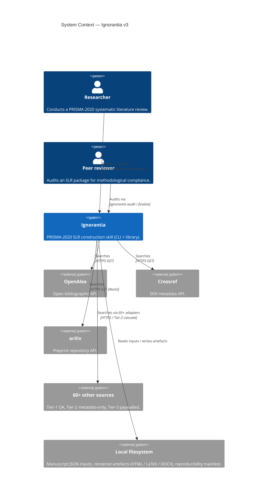
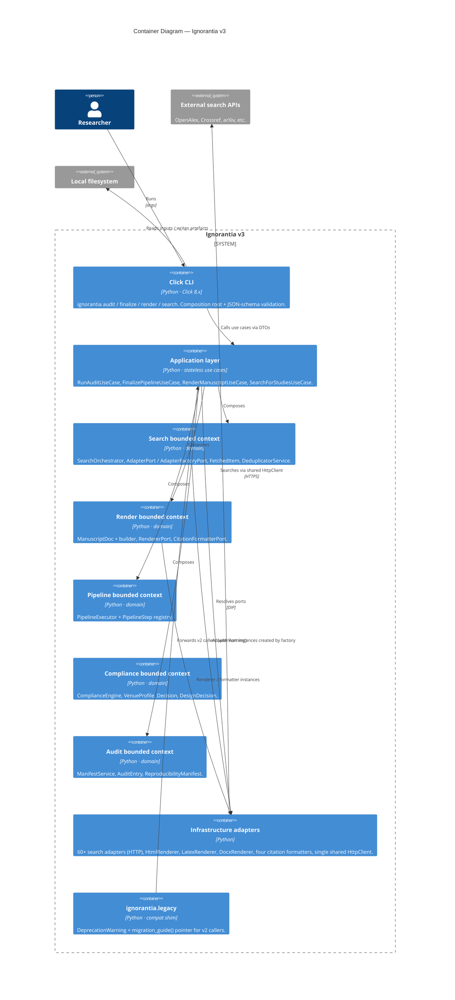
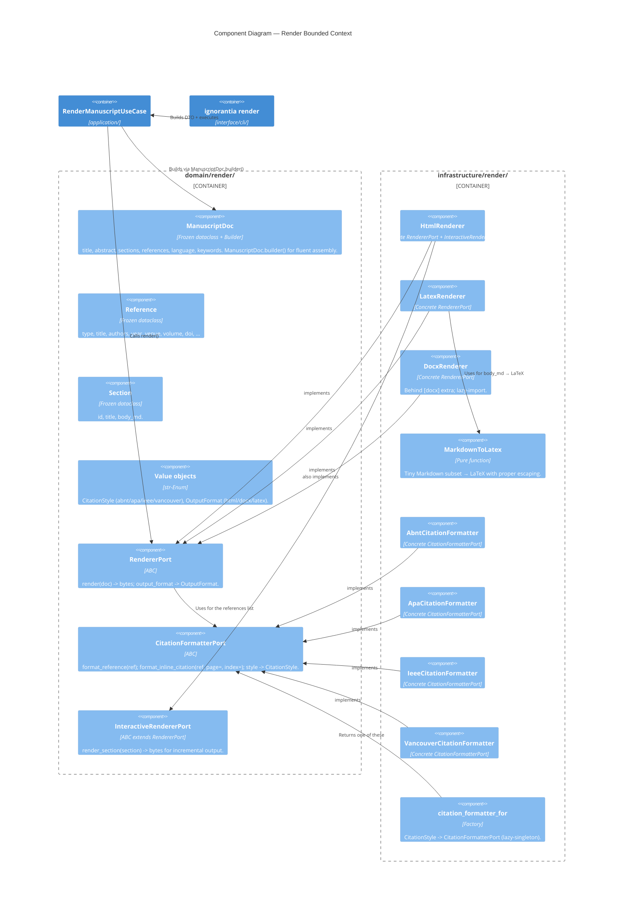

# C4 architecture diagrams — Ignorantia v3

The diagrams below follow Simon Brown's C4 model: Context →
Container → Component (Code level intentionally omitted; the
codebase + docstrings are the source of truth at that resolution).
All diagrams are written in Mermaid so GitHub renders them inline
without extra tooling.

To regenerate or export to SVG/PNG locally, use any Mermaid
renderer (e.g. `npx @mermaid-js/mermaid-cli -i C4_DIAGRAMS.md`).

---

## Level 1 — System Context

Who uses Ignorantia and what does it talk to?

---

## Level 2 — Container

What runs inside the Ignorantia system boundary?

The compliance bounded context is omitted from the relations above
to keep the diagram readable: it is composed by future use cases
(planned: `EvaluateManuscriptUseCase`) but is not yet wired through
a CLI subcommand in v3.0.0-alpha.

---

## Level 3 — Component (Render bounded context)

The render context drilled down to its components. The pattern is
representative — search, audit, pipeline, and compliance follow the
same shape (entities + ports + services + factory + concrete
adapters in `infrastructure/`).

---

## What's not drawn

* **Code-level (Level 4)** — UML class diagrams are intentionally
  omitted. Each class' shape is best read in its own
  `entities.py` / `value_objects.py` / `services.py` file with
  the `mypy --strict` annotations as the source of truth.
* **Data flow timing** — sequence diagrams (search → render →
  audit) belong in the tutorial and the architecture-plan
  document, not at the C4 level.
* **Deployment view** — Ignorantia ships as a Python package
  installed via pip; there is no separate runtime topology to
  draw.

For the design rationale behind the bounded-context split, the
DDD vocabulary, and the SOLID principle mapping, see
[`dev-docs/V3_ARCHITECTURE_PLAN.xml`](../../dev-docs/V3_ARCHITECTURE_PLAN.xml).
